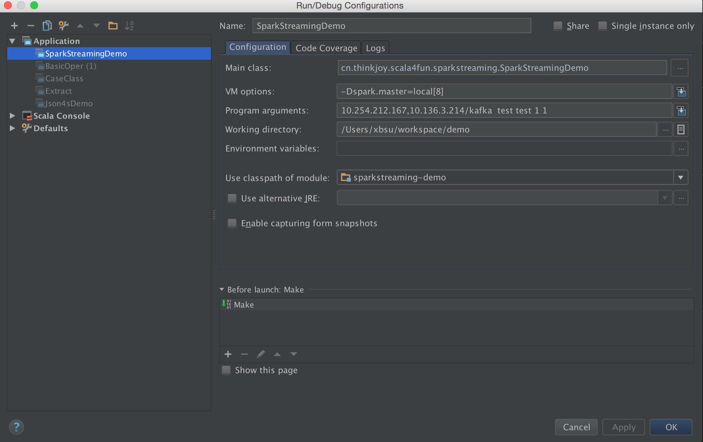

#spark streaming
从kafka读取数据，通过spark streaming处理，并确保可靠性，可在实际应用中使用。

idea调试过程中，application配置文件的配置如下：


测试命令

```scala
spark-submit --master local[5] --class cn.thinkjoy.scala4fun.sparkstreaming.SparkStreamingDemo sparkstreaming-demo-1.0-SNAPSHOT-jar-with-dependencies.jar 10.254.212.167,10.136.3.214/kafka  test test 1 1
```

在实际环境中，只需去掉 *--master local[5]*